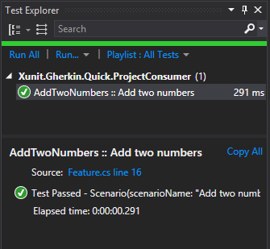

[](https://ci.appveyor.com/project/ttutisani/xunit-gherkin-quick/branch/master)

# Xunit.Gherkin.Quick
Xunit.Gherkin.Quick is a lightweight, cross platform BDD test framework (targets .NET Standard, can be used from both .NET and .NET Core test projects). It parses Gherkin language and executes Xunit tests corresponding to scenarios.

# Getting Started
We'll quickly setup our project, write our first BDD test, and then run it.

## Xunit test project

Create a new or open existing Xunit test test project. `Xunit.Gherkin.Quick` needs to be used with Xunit.

## Install nuget package

Package name to search for through GUI: `Xunit.Gherkin.Quick`

Package Manager:
```powershell
Install-Package Xunit.Gherkin.Quick
```

.NET Core:
```powershell
dotnet add package Xunit.Gherkin.Quick
```

That should be it, but if you need more info about installation or the nuget package, click here: https://www.nuget.org/packages/Xunit.Gherkin.Quick/

## Create Gherkin feature file

Create a new text file. Name it as 'AddTwoNumbers.feature'.

_NOTE: In practice, you can name your files in any way you want, and .feature extension is not necessary either._

Copy the below code and paste it into your feature file:
```Gherkin
Feature: AddTwoNumbers
	In order to learn Math
	As a regular human
	I want to add two numbers using Calculator

Scenario: Add two numbers
	Given I chose 12 as first number
	And I chose 15 as second number
	When I press add
	Then the result should be 27 on the screen
```

This is a BDD style feature written in [Gherkin language] (https://cucumber.io/docs/reference).

**Important**: change feature file properties to ensure it gets copied into output directory. Set the value of `Copy to Output Directory` to `Copy Always` or `Copy if Newer`.

Now it's time to implement the code to run scenarios of this feature.

## Implement Feature Scenario

Implementing a scenario simply means writing methods in the `Feature`-derived class. Goal is to ensure that each scenario step above will match a method by using regex syntax. If we miss a step and it does not match a method, we will receive an error when we try to run the scenario test.

Here is how we can implement the scenario of the above feature:

```C#
[FeatureFile("./Addition/AddTwoNumbers.feature")]
public sealed class AddTwoNumbers : Feature
{
    private readonly Calculator _calculator = new Calculator();

    [Given(@"I chose (\d+) as first number")]
    public void I_chose_first_number(int firstNumber)
    {
        _calculator.SetFirstNumber(firstNumber);
    }

    [And(@"I chose (\d+) as second number")]
    public void I_chose_second_number(int secondNumber)
    {
        _calculator.SetSecondNumber(secondNumber);
    }

    [When(@"I press add")]
    public void I_press_add()
    {
        _calculator.AddNumbers();
    }

    [Then(@"the result should be (\d+) on the screen")]
    public void The_result_should_be_z_on_the_screen(int expectedResult)
    {
        var actualResult = _calculator.Result;

        Assert.Equal(expectedResult, actualResult);
    }
}
```

Notice couple of things:

- `FeatureFile` attribute for the class refers to the feature file location. You don't need to apply this attribute if you keep your feature files in the root directory of your project, because that's where it will be located by default. Buf if you keep it under a sub-folder (which I do), then make sure to specify the file location (either relative or absolute) using this attribute.

- `Given`, `When` and `Then` attributes for the methods specify scenario steps that they are supposed to handle. They can be either a plain text or they can also extract values out of the scenario step, which will be passed as a method argument value. You can also use `And` and `But` attributes, in exactly the same way.

## Run Scenario

Build BDD tests project.

If you use command line to run unit tests, simply run them as always. You should see the scenario full name in the results as a newly added unit test name.

If you use Visual Studio to run unit tests, open Test Explorer to see the new unit test. Right click and run it as you would usually run unit tests through test explorer.

Unit test name in this case will be "AddTwoNumbers :: Add two numbers", which is a combination of feature name "AddTwoNumbers" and scenario name "Add two numbers".



## Add More Scenarios

If the feature has multiple scenarios, add them to the same feature file. They will show up as additional tests in the test explorer. And they will need additional methods in the same feature class for execution.

## Further Topics
- [Viewing steps executed for a Scenario](Test-Steps.md)
- [Using table data in tests](Table-Data.md)

