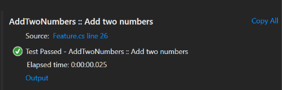
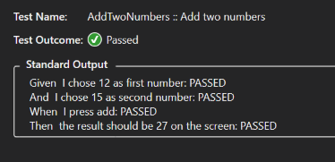

# Viewing steps executed for a Scenario

To view the steps executed for a scenario test run, select the item in test explorer and click the 'Output' link.

You will be shown a list of the steps which have been executed, along with each steps success or failure.

