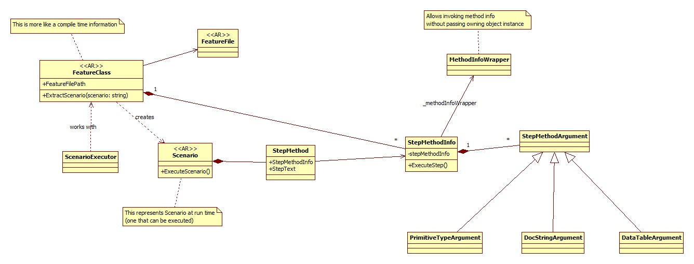

# Domain Model

This document explains how contributors should approach the codebase when modifying existing or adding new components to it.

## Design Intention

Model should reveal the meaning, rather than pure technical development forces. e.g. prefer putting things together due to conceptual cohesion, instead of separating them just because you want to inject one part into another.

Model should closely correspond to how the framework works. Concepts should be expressed using nouns and verbs just as we describe them in regular conversations. Associations (relations) between them should be just as we think of it or explain to others.

## Technical Design Guidelines

Each class should strictly encapsulate its state. Direct modification of the state from outside is prohibited. State modification is only possible by calling a method on the class. This is true for the state modification of the class, as well as the nested members of the class, if they have state which can be modified.

[Law of Demeter](https://en.wikipedia.org/wiki/Law_of_Demeter) is highly regarded. If you want to call a method on the nested member of the class, you can't do that without calling a method on the container class. i.e., encapsulate nested members as well as the access to them.

A class is allowed to expose properties which give some basic **immutable** information about the class. Minimalism is preferred.

## Model for Executing Scenario

(Notice how the model can be described close to how it works in speech)

All the magic starts in `ScenarioExecutor` class.

`ScenarioExecutor` is a service that allows executing a single scenario by its name. It starts by acquiring an instance of `FeatureClass`, which has all the `StepMethod`s in it. `FeatureClass` also has a path to the feature file. By using that path, `ScenarioExecutor` acquires instance of `FeatureFile` - which has definitions of all scenarios.

To extract a specific `Scenario` out of the `FeatureClass`, we need to find all methods in it which correspond to the steps mentioned in the `FeatureFile`. While extracting, we also ensure that the values extracted out of the scenario steps can be assigned to the method arguments (they are represented as implementations of `StepMethodArgument` base class).

Once the `Scenario` instance is extracted out of the `FeatureClass`, we just need to execute it. That simply means to execute all steps (all instances of `StepMethod`) of the scenario.

### Class Diagram

