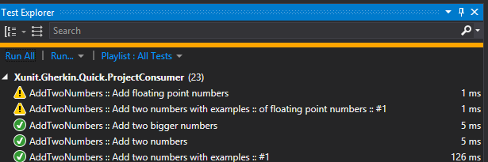

# Ignoring Scenario, Scenario Outline, Examples, or Feature

There are cases when you want to temporarily ignore a scenario, scenario outline, examples, or feature execution.

For this, you can use `@ignore` tag. You can attach it to any of the elements listed above. This tag (just as any other tag) gets inherited. i.e. when you ignore a feature, all scenarios and scenario outlines are ignored under that feature.

Here is the example of a feature which has 2 elements ignored - examples "of large numbers" under a scenario outline named "Add two numbers with examples", and a scenario named "Add floating point numbers".

```Gherkin
Feature: AddTwoNumbers
	In order to learn Math
	As a regular human
	I want to add two numbers using Calculator


Scenario Outline: Add two numbers with examples
	Given I chose <a> as first number
	And I chose <b> as second number
	When I press add
	Then the result should be <sum> on the screen

	@addition
	Examples:
		| a   | b   | sum |
		| 0   | 1   | 1   |
		| 1   | 9   | 10  |

	Examples: of bigger numbers
		| a   | b   | sum |
		| 99  | 1   | 100 |
		| 100 | 200 | 300 |

	@bigaddition
	Examples: of large numbers
		| a    | b | sum   |
		| 999  | 1 | 1000  |
		| 9999 | 1 | 10000 |

	@ignore
	Examples: of floating point numbers
		| a   | b   | sum |
		| 1.1 | 2.2 | 3.3 |

@ignore
Scenario: Add floating point numbers
	Given I chose 1.11 as first number
	And I chose 2.22 as second number
	When I press add
	Then the result should be 3.33 on the screen
  
```

Items that are not ignored will execute as usual, i.e. other examples of the scenario outline "Add two numbers with examples".

Ignored elements are still discovered by the test runners, but they are skipped during execution. Interface and output will be similar to ignored/skipped unit test.

Yellow triangle in front of the 2 scenarios below denotes skipped items after test execution in Visual Studio test runner.


